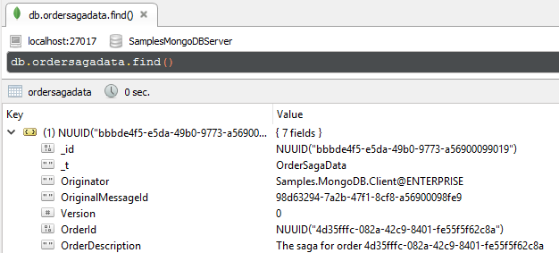
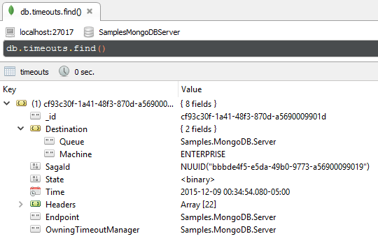
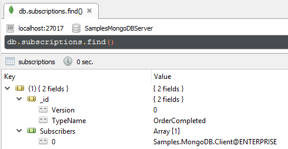

## Prerequisites

Ensure an instance of [MongoDB](https://www.mongodb.com/) is running on `localhost:27017`. See [Install MongoDB on Windows](https://docs.mongodb.com/manual/tutorial/install-mongodb-on-windows/).


### MongoDB management UI

To visualize the data in MongoDB, it is useful to install a [MongoDB administration tool](https://docs.mongodb.com/ecosystem/tools/). The screen shots shown in this sample use [Robomongo](https://robomongo.org/).


## Code walk-through

This sample shows a simple client/server scenario:

 * `Client` sends a `StartOrder` message to `Server`
 * `Server` starts an `OrderSaga`.
 * `OrderSaga` requests a timeout with a `CompleteOrder` data.
 * When the `CompleteOrder` timeout fires the `OrderSaga` publishes an `OrderCompleted` event.
 * `Server` then publishes a message that the client subscribes to.
 * `Client` handles the `OrderCompleted` event.


### MongoDB configuration

The `Server` endpoint is configured to use the MongoDB persistence with a connection string of `mongodb://localhost:27017/SamplesMongoDBServer`.

```
var endpointConfiguration = new EndpointConfiguration("Samples.MongoDB.Server");
var persistence = endpointConfiguration.UsePersistence<MongoDbPersistence>();
persistence.SetConnectionString("mongodb://localhost:27017/SamplesMongoDBServer");
```


### Order saga data

`NServiceBus.Persistence.MongoDB` [requires a property on the saga decorated with attribute `[DocumentVersion]`](https://github.com/tekmaven/NServiceBus.Persistence.MongoDB/#saga-definition-guideline), usually named Version.

```
public class OrderSagaData :
    IContainSagaData
{
    public Guid Id { get; set; }
    public string Originator { get; set; }
    public string OriginalMessageId { get; set; }

    [DocumentVersion]
    public int Version { get; set; }

    public Guid OrderId { get; set; }
    public string OrderDescription { get; set; }
}
```


### Order saga

```
public class OrderSaga :
    Saga<OrderSagaData>,
    IAmStartedByMessages<StartOrder>,
    IHandleTimeouts<CompleteOrder>
{
    static ILog log = LogManager.GetLogger<OrderSaga>();

    protected override void ConfigureHowToFindSaga(SagaPropertyMapper<OrderSagaData> mapper)
    {
        mapper.ConfigureMapping<StartOrder>(message => message.OrderId)
            .ToSaga(sagaData => sagaData.OrderId);
    }

    public Task Handle(StartOrder message, IMessageHandlerContext context)
    {
        Data.OrderId = message.OrderId;
        var orderDescription = $"The saga for order {message.OrderId}";
        Data.OrderDescription = orderDescription;
        log.Info($"Received StartOrder message {Data.OrderId}. Starting Saga");
        log.Info("Order will complete in 5 seconds");
        var timeoutData = new CompleteOrder
        {
            OrderDescription = orderDescription
        };
        return RequestTimeout(context, TimeSpan.FromSeconds(5), timeoutData);
    }

    public Task Timeout(CompleteOrder state, IMessageHandlerContext context)
    {
        log.Info($"Saga with OrderId {Data.OrderId} completed");
        var orderCompleted = new OrderCompleted
        {
            OrderId = Data.OrderId
        };
        MarkAsComplete();
        return context.Publish(orderCompleted);
    }
}
```


## The data in MongoDB

The data in MongoDB is stored in three different collections.


### Saga data

 * `IContainSagaData.Id` maps to the native MongoDB document `_id`
 * `IContainSagaData.Originator` and `IContainSagaData.OriginalMessageId` map to simple properties pairs.
 * Custom properties on the SagaData, in this case `OrderDescription` and `OrderId`, are also mapped to simple properties.
 * `_t` is type serialization metadata used by the underlying MongoDB Driver.
 * `DocumentVersion` used by `NServiceBus.Persistence.MongoDB` to prevent concurrency issues.




### Timeouts

 * The subscriber is stored in a `Destination` with the nested properties `Queue` and `Machine`.
 * The endpoint that initiated the timeout is stored in the `OwningTimeoutManager` property
 * The connected saga ID is stored in a `SagaId` property.
 * The serialized data for the message is stored in a `State` property.
 * The scheduled timestamp for the timeout is stored in a `Time` property.
 * Any headers associated with the timeout are stored in an array of key value pairs.




### Subscriptions

Note that the message type maps to multiple subscriber endpoints.

 * The subscription message type and version are stored as a composite key in the MongoDB document `_id` property.
 * The list of subscribers is stored in a array of strings containing `Queue@MachineName` values.

